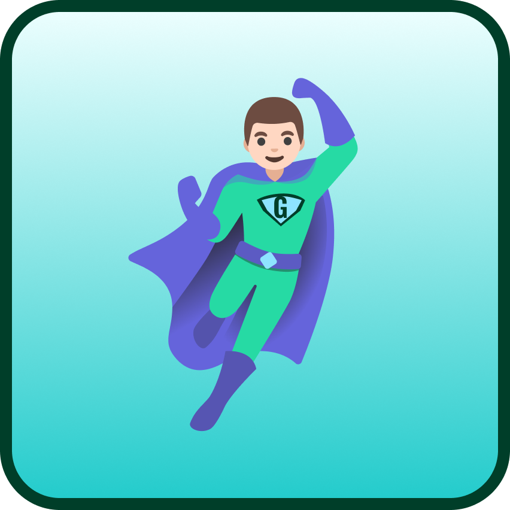

 

  
  <h1 color="green">Green Hero</h2>
  
A project developed for the course of Android development

  

 

## What is Green Hero?
Green Hero is an Android application that makes recycling easy and rewarding. 
Recycle items and earn rewards for a greener planet!

## Technologies 
### Frontend
- 
### Backend
- 
- 
### Build
- 
### Version Control
- 

## Tools
- 
- 

## Download and try the app!
- Clone the repository in an Android Studio environment using this url 
https://github.com/Green-Hero-Android-Group/Green-Hero.git

- Run the default configuration

## Operation of the app
Since you are new to the application, those are some simple steps you want to follow:
1) Create your free account: Takes just a minute!
2) Go to the Recycle page through the navigation
3) Recycle the items of your choice
4) Log out through your profile page
5) Log in with admin credentials
6) Approve your requests
7) Go back to your account
8) Enjoy your rewards

### Admin Credentials
- E-mail: admin@gh.com
- Password: 123456

## Check a simple example of how to use our application  
<a href="https://www.youtube.com/watch?v=aOOWNVhSRk4">Click to see the video</a>

## License
This app is licensed under the <a href="https://github.com/Green-Hero-Android-Group/Green-Hero/blob/main/LICENSE">MIT License</a>.

## Contributors
- <a href="https://github.com/dimsparagis0210">Dimitris Sparagis</a>
- <a href="https://github.com/vtmag">Magda Vitsioti</a>
- <a href="https://github.com/cstergiou03">Christos Stergiou</a>
- <a href="https://github.com/JohnSfy">Giannis Sfyrakis</a>
- <a href="https://github.com/ZoiSpi">Zoi Spiridopoulou</a>
 
 
<a href="#readme-top">Go to the top</a>
